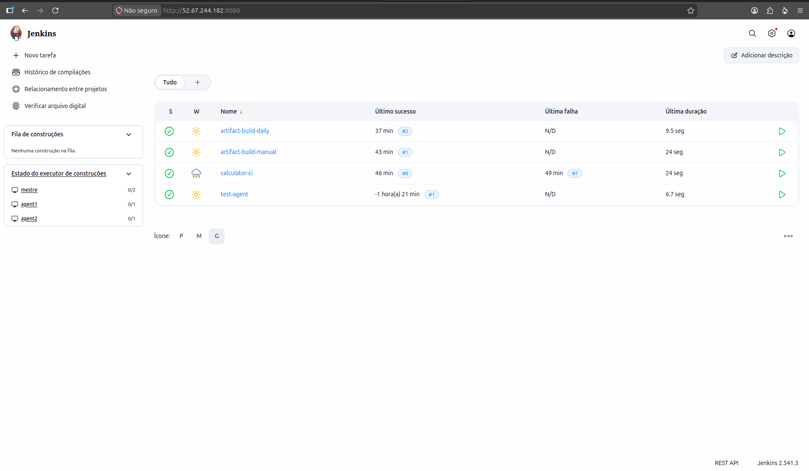
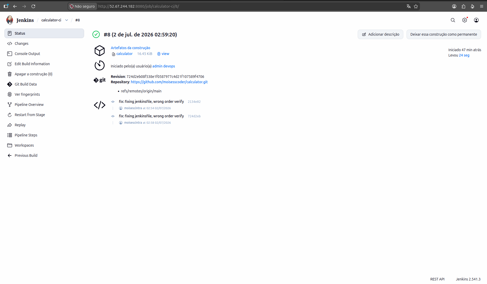
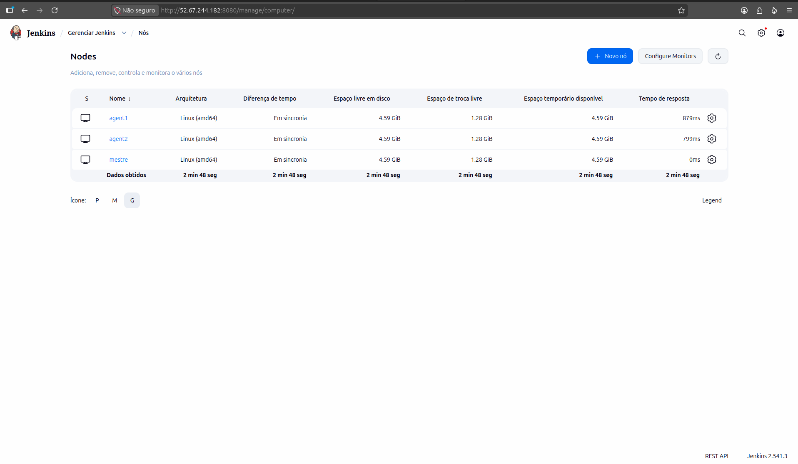

# Infraestrutura CI/CD — Calculator

Documentação da solução de integração e entrega contínua implementada para o projeto Calculator (C++17), conforme requisitos da prova DevOps.

## 1. Visão geral

| Item | Valor |
|---|---|
| Instância | Ubuntu 24.04 — `52.67.244.182` |
| Orquestrador | Jenkins LTS (JDK 17) em container Docker |
| Agentes | 2 nós (`agent1`, `agent2`) em containers Ubuntu 24.04 |
| Repositório | https://github.com/moisesscoder/calculator |
| Label dos agentes | `cpp-build` |

A stack roda via Docker Compose no diretório `infra/`. O controller Jenkins expõe a UI na porta 8080. Os agentes se conectam ao controller por SSH e executam os builds C++17.

## 2. Acesso à instância

A chave fornecida estava no formato PuTTY (`.ppk`), incompatível com o OpenSSH do Linux. Conversão necessária antes do primeiro acesso:

```bash
puttygen Test_DevOps.ppk -O private-openssh -o Test_DevOps.pem
chmod 400 Test_DevOps.pem
ssh -i Test_DevOps.pem ubuntu@52.67.244.182
```

Liberar a porta **8080** no Security Group da instância para acesso à UI do Jenkins.

## 3. Arquitetura

```
                    ┌─────────────────────┐
                    │   GitHub (fork)     │
                    │  moisesscoder/      │
                    │    calculator       │
                    └─────────┬───────────┘
                              │ webhook / poll SCM
                    ┌─────────▼───────────┐
                    │  Jenkins Controller │
                    │  (jenkins:8080)     │
                    └─────────┬───────────┘
                              │ SSH
              ┌───────────────┼───────────────┐
              │                               │
    ┌─────────▼─────────┐         ┌───────────▼─────────┐
    │  jenkins-agent-1  │         │  jenkins-agent-2    │
    │  label: cpp-build │         │  label: cpp-build   │
    │  g++, GTest,      │         │  g++, GTest,          │
    │  clang-tidy, etc. │         │  clang-tidy, etc.     │
    └─────────┬─────────┘         └───────────┬─────────┘
              │                               │
              └───────────────┬───────────────┘
                              │
              ┌───────────────▼───────────────┐
              │  Artefatos                    │
              │  • Jenkins archiveArtifacts   │
              │  • /home/jenkins/artifacts/   │
              └───────────────────────────────┘
```

### Evidências visuais

> Salvar os prints na pasta `docs/images/` com os nomes indicados abaixo.

**Dashboard Jenkins** — visão geral dos jobs configurados:



**Pipeline em execução** — estágios do `calculator-ci` com build em andamento ou concluído:



**Agentes online** — `agent1` e `agent2` com status disponível:



## 4. Provisionamento

### 4.1 Dependências no host

```bash
sudo apt update
sudo apt install -y docker.io docker-compose-v2 git
sudo usermod -aG docker ubuntu
# reconectar SSH
```

### 4.2 Swap (obrigatório nesta instância)

A VM possui ~908 MB de RAM. Sem swap, o processo Java do Jenkins é encerrado pelo OOM killer durante compilações C++.

```bash
sudo fallocate -l 2G /swapfile
sudo chmod 600 /swapfile
sudo mkswap /swapfile
sudo swapon /swapfile
echo '/swapfile none swap sw 0 0' | sudo tee -a /etc/fstab
```

Confirmado via `dmesg`: processo `java` do container Jenkins morto com `anon-rss:388480kB` antes da criação do swap.

### 4.3 Subir a stack

```bash
git clone https://github.com/moisesscoder/calculator.git
cd calculator/infra
docker compose build
docker compose up -d
docker compose ps
```

O `docker-compose.yml` inclui `JAVA_OPTS=-Xmx256m` no Jenkins para limitar o heap da JVM e reduzir pressão de memória no host.

### 4.4 Imagem do agente (`Dockerfile.agent`)

Base Ubuntu 24.04 com toolchain completo para o projeto:

- `g++` (C++17), `make`, `git`
- `clang-tidy`, `clang-format`
- Google Test (`libgtest-dev`) com headers/libs em `/usr/local/` — compatível com `tests/Makefile`
- OpenSSH para conexão com o controller Jenkins
- Usuário `jenkins` (senha: `jenkins`)

## 5. Configuração do Jenkins

### 5.1 Setup inicial

```bash
docker exec jenkins cat /var/jenkins_home/secrets/initialAdminPassword
```

Acessar `http://52.67.244.182:8080`, instalar plugins sugeridos, criar usuário admin.

### 5.2 Registro dos agentes

O controller Jenkins apenas orquestra as execuções — agenda jobs, monitora estágios, armazena logs e artefatos. Os agentes executam efetivamente os builds (`make`, `clang-tidy`, `g++`), permitindo escalabilidade e isolamento das tarefas. Com dois nós e o label `cpp-build`, o Jenkins distribui os jobs entre agentes disponíveis sem sobrecarregar o controller.

**Manage Jenkins → Nodes → New Node** (repetir para `agent1` e `agent2`):

| Campo | Valor |
|---|---|
| Remote root directory | `/home/jenkins/workspace` |
| Labels | `cpp-build` |
| Usage | Deixar o processamento para atividades vinculadas |
| Launch method | Launch agents via SSH |
| Host | `agent1` / `agent2` (hostname na rede Docker) |
| Credentials | `jenkins` / `jenkins` |
| Host Key Verification | Non verifying Verification Strategy |

Os dois agentes devem aparecer **online** antes de executar pipelines.

## 6. Pipelines

Todos os pipelines usam `Pipeline script from SCM` apontando para o repositório Git, branch `*/main`.

### 6.1 `calculator-ci` — Integração contínua

| Item | Detalhe |
|---|---|
| Script | `Jenkinsfile` |
| Trigger | Webhook GitHub + SCM polling (`H/5 * * * *`) + manual |
| Agente | `cpp-build` (definido no Jenkinsfile) |

O **SCM Polling** consulta periodicamente o repositório Git para detectar alterações e iniciar automaticamente o pipeline. Funciona como fallback caso o webhook não dispare. A expressão `H/5 * * * *` verifica a cada 5 minutos, com deslocamento aleatório (`H`) para evitar que todos os jobs consultem o Git no mesmo instante.

Estágios — qualquer falha derruba o build:

1. **Checkout** — clone do repositório
2. **Code Check** — `make check` (clang-tidy + clang-format)
3. **Unit Tests** — `make unittest` (GTest)
4. **Build** — `make clean && make` + `archiveArtifacts`

### 6.2 `artifact-build-manual` — Artefato sob demanda

| Item | Detalhe |
|---|---|
| Script | `Jenkinsfile.artifact` |
| Trigger | Somente manual |

Fluxo: checkout → build → armazenamento.

### 6.3 `artifact-build-daily` — Artefato agendado

| Item | Detalhe |
|---|---|
| Script | `Jenkinsfile.artifact` |
| Trigger | Cron `H 2 * * *` (diário, ~2h UTC) |

Cópia do job manual com trigger periódico adicionado.

### 6.4 Integração com GitHub (webhook)

O pipeline `calculator-ci` também pode ser disparado automaticamente a cada push no repositório via webhook GitHub, sem depender exclusivamente do polling.

**No Jenkins** (`calculator-ci` → Configurar → Triggers):
- Marcar **GitHub hook trigger for GITScm polling**

**No GitHub** (repositório → Settings → Webhooks → Add webhook):

| Campo | Valor |
|---|---|
| Payload URL | `http://52.67.244.182:8080/github-webhook/` |
| Content type | `application/json` |
| Events | Just the push event |

A porta 8080 precisa estar acessível publicamente para o GitHub alcançar o endpoint. Após configurar, um push em `main` dispara o pipeline em segundos.

## 7. Armazenamento de artefatos

Dupla persistência:

1. **Jenkins** — `archiveArtifacts` com fingerprint. Disponível na UI do build em *Artifacts*. Os artefatos ficam versionados por número de build — cada execução gera um diretório próprio (ex.: build `#3` contém o binário daquela execução específica).
2. **Agente** — cópia em `/home/jenkins/artifacts/<job-name>/<build-number>/calculator`.

Verificação no agente:

```bash
docker exec jenkins-agent-1 ls -la /home/jenkins/artifacts/
```

Exemplo validado:

```
/home/jenkins/artifacts/artifact-build-manual/1/calculator  (16840 bytes)
/home/jenkins/artifacts/artifact-build-daily/2/calculator   (16840 bytes)
```

## 8. Correções no código-fonte

O repositório base continha problemas que impediam o pipeline de integração de passar. Corrigidos no fork antes de declarar o CI funcional:

| Problema | Arquivo | Correção |
|---|---|---|
| Variáveis não inicializadas | `calculator/src/main.cpp` | Inicialização explícita (`double number1 = 0.0`) |
| Divisão por zero sem tratamento | `calculator/src/calculator.hpp` | Guarda `if (number2 == 0) return 0` em `divide()` |
| Formatação fora do padrão Google | `calculator/src/main.cpp` | `clang-format --style=google -i src/main.cpp` |

Sem essas correções, `make check` e `make unittest` falham — e o enunciado trata qualquer erro de estágio como crítico.

## 9. Troubleshooting

### Jenkins reinicia ao iniciar build

**Causa:** OOM killer encerra o processo Java.
**Solução:** Swap de 2 GB + `JAVA_OPTS=-Xmx256m` no container Jenkins.

### `No artifacts found that match the file pattern`

**Causa:** `cleanWs()` no bloco `post { always }` executa antes de `archiveArtifacts` no `post { success }` — ordem fixa do Declarative Pipeline.
**Solução:** `archiveArtifacts` movido para dentro do stage Build, antes do cleanup.

### Agente offline durante compilação

**Causa:** Contenção de CPU/memória em ambiente virtualizado aninhado (observado em testes locais com Multipass).
**Solução:** Executar a stack na instância da prova, onde os containers rodam diretamente no host.

### Webhook não dispara o pipeline

**Causa:** Porta 8080 bloqueada no Security Group ou URL incorreta.
**Solução:** Liberar inbound na porta 8080; confirmar URL `http://<IP>:8080/github-webhook/` (com barra final). Verificar entrega em GitHub → Webhooks → Recent Deliveries.

## 10. Operação

### Subir / parar

```bash
cd ~/calculator/infra
docker compose up -d      # iniciar
docker compose down       # parar (volume jenkins_home persiste config)
docker compose ps         # status
docker stats --no-stream  # consumo de recursos
```

### Disparar builds manualmente

Na UI do Jenkins: selecionar o job → **Construir agora**.

### Após reboot da VM

```bash
sudo swapon /swapfile     # se swap não montou automaticamente
cd ~/calculator/infra && docker compose up -d
```

Aguardar agentes ficarem online antes de executar pipelines.

## 11. Estrutura de arquivos relevantes

```
calculator/
├── Jenkinsfile              # Pipeline CI
├── Jenkinsfile.artifact     # Pipeline de artefatos
├── infra/
│   ├── docker-compose.yml   # Stack Jenkins + agentes
│   └── Dockerfile.agent     # Imagem dos agentes C++17
├── calculator/
│   ├── Makefile
│   ├── src/
│   └── tests/
└── docs/
    ├── INFRAESTRUTURA.md    # este documento
    └── images/              # prints de evidência
        ├── jenkins-dashboard.png
        ├── jenkins-pipeline.png
        └── jenkins-agents.png
```
